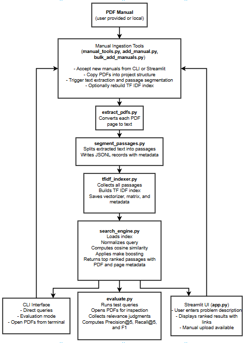

# AutoAssist: Vehicle Maintenance Search Engine

Course: CS410 - Text Information Systems, UIUC  
Author: Kunal Sinha  
Repo: https://github.com/kunal7illinois/AutoAssist

---

## Table of Contents
1. [Overview and Motivation](#1-overview-and-motivation)  
2. [System Features](#2-system-features)  
3. [Data Pipeline](#3-data-pipeline)  
4. [Architecture](#4-architecture)  
5. [Setup and Installation](#5-setup-and-installation)  
6. [Using AutoAssist (UI and CLI)](#6-using-autoassist-ui-and-cli)  
7. [Performance and Evaluation](#7-performance-and-evaluation)  
8. [Limitations and Future Work](#8-limitations-and-future-work)

---

## 1. Overview and Motivation

AutoAssist is a lightweight search engine that makes car maintenance information easier to find. Most cars do not come with a single clean service manual. They come with many separate PDF documents, each covering a different subsystem. A single problem might show up in a diagnostic flowchart in one manual, a replacement procedure in another, and a short note in a troubleshooting table somewhere else.

In practice, this means a lot of time spent opening PDFs, scrolling, and hoping that a keyword search matches the exact wording used in the manual. Different manufacturers also describe similar issues in different ways, and sometimes a good explanation in one car's manual is still useful for a similar symptom on another car.

AutoAssist treats all of these manuals as one text corpus instead of a pile of disconnected files. It converts them into smaller passages, builds a TF IDF index, and lets you search across every manual at once. You can type a short description of an issue and immediately pull up the most relevant sections, with links back to the exact PDF page. AutoAssist also lets you add your own manuals, so the system can grow as you collect more documents.

The goal is simple: make it faster and more practical to navigate large sets of automotive manuals and connect a described symptom to the pages that actually help.

---

## 2. System Features

AutoAssist behaves like a real search engine on top of TF IDF, not just a simple PDF keyword finder. Key features:

1. **Full corpus search**  
   All manuals across all makes and models are indexed into one TF IDF index. A single query can retrieve passages from any document in the collection.

2. **Manual ingestion workflow**  
   New manuals can be added from either the command line or the Streamlit UI. The system handles copying PDFs, extracting text, and segmenting passages.

3. **Two interfaces (UI and CLI)**  
   AutoAssist can be used through a Streamlit web app or through a command line interface. Both share the same index and search engine.

4. **Passage level retrieval with PDF links**  
   Pages are split into smaller passages. Each result includes the manual name and page number, and the system can open the correct PDF so you can jump straight to the right place.

5. **Query normalization and expansion**  
   A rule based normalizer expands certain problem terms into related technical language to improve recall when manuals use slightly different wording.

6. **Car make detection and boosting**  
   If the query mentions a manufacturer, passages from that make receive a score boost so that car specific content shows up more prominently.

7. **Rebuildable TF IDF index**  
   After new manuals are added, the index can be rebuilt to include the new passages.

8. **Evaluation module**  
   A built in evaluation script runs a set of test queries, collects human relevance judgments, and reports Precision at 5, Recall at 5, and F1.

---

## 3. Data Pipeline

The AutoAssist pipeline converts raw service manuals into a unified TF IDF index that supports fast passage level search. It has four main stages:

1. **PDF to raw text**  
   Each manual is copied into the data directory and processed page by page. Every page is extracted into plain text using pdfplumber, giving a clean text version of the manual.

2. **Passage segmentation**  
   Extracted pages are segmented into smaller passages by grouping sentences based on a length threshold. Each passage is stored as a JSONL record with metadata such as make, model, source PDF, and page number.

3. **Corpus assembly and indexing**  
   All passage records are combined into a single corpus. The TF IDF indexer loads them, fits a TfidfVectorizer, and transforms every passage into a vector. It saves the vectorizer, the sparse TF IDF matrix, and the metadata in the index directory.

4. **Query transformation and scoring**  
   At search time, the user query is normalized, transformed into a TF IDF vector, and compared against all passage vectors with cosine similarity. The top scoring passages are returned along with their PDF and page metadata.

This setup keeps each stage simple and modular while scaling to many manuals.

---

## 4. Architecture

The system is organized as a pipeline from PDF ingestion to search. Each major step is handled by a separate python module.



High level notes:

- Manual ingestion is the first step. It copies PDFs, extracts text, segments passages, and can trigger an index rebuild.
- Once the index is built, both the CLI and Streamlit interfaces call the same search engine.
- Adding new manuals loops through the ingestion and indexing steps again so fresh content becomes searchable.

---

## 5. Setup and Installation

This section assumes you are starting from a clean machine.

### 5.1 Prerequisites

Install:

- Python 3.9 or later  
- pip  
- Git (optional if you use the ZIP download)  
- Any PDF reader

### 5.2 Get the Code

You can clone the repo or download a ZIP.

Clone (recommended):

```bash
git clone https://github.com/kunal7illinois/AutoAssist.git
cd AutoAssist
```

Or download:

1. Go to https://github.com/kunal7illinois/AutoAssist  
2. Click the Code button  
3. Click Download ZIP and extract it  
4. You should now have a folder named `AutoAssist`

All commands below assume you are inside this `AutoAssist` folder.

### 5.3 Install Python Dependencies

```bash
pip install -r requirements.txt
```

This installs Streamlit, scikit learn, pdfplumber, numpy, nltk, and other required packages.

### 5.4 Set Up the Data Directory

The repo already includes the TF IDF index and core corpus files. You only need to place the manuals in the right location.

1. Download the manuals package from:  
   https://drive.google.com/file/d/1ZjNO5KipRuTRMH3hB8ilCPySBzLZd-zc/view

2. Extract the ZIP.

3. Move the extracted folders into `AutoAssist/data/` so the structure looks like:

```text
AutoAssist/
    data/
        manuals/       (full collection of real manuals)
        corpus/        (passages plus prebuilt TF IDF index)
        Test_Manuals/  (optional sample PDFs for ingestion tests)
    src/
    requirements.txt
    README.md
```

Manuals in `Test_Manuals` are not used until you explicitly ingest them through the UI or CLI.

---

## 6. Using AutoAssist (UI and CLI)

AutoAssist can be used from the Streamlit web UI or from the command line. Both share the same TF IDF index and search engine.

Before running anything, make sure you are in the project root:

```text
AutoAssist/
    data/
    src/
    requirements.txt
```

Use `cd` to move into this folder if needed.

### 6.1 Running the Streamlit UI

Start the web app:

```bash
streamlit run src/app.py
```

Streamlit will start a local server and usually open a browser window. If it does not, copy the URL from the terminal into your browser.

### 6.2 Running a Search in the UI

1. Type a short description of your car problem into the text box.  
2. Click the `Diagnose` button.

The UI shows:

- The normalized version of your query  
- A detected manufacturer if one is found  
- A ranked list of passages with make, model, page number, score, and excerpt  

### 6.3 Opening Manual Pages

Each result has an `Open PDF` link.

Clicking it:

- Opens the corresponding manual  
- Jumps to the correct page number  

If the PDF does not open right away:

- Wait a few seconds  
- Refresh the browser and try again  
- Restart Streamlit if needed  

Large manuals can take some time to load.

### 6.4 Adding Manuals Through the UI

In the `Add New Manuals` section you can upload:

- A single PDF  
- Multiple PDFs  
- A folder of PDFs for the same make and model  

Files can live anywhere on your machine. Just select them in the upload dialog.

Steps:

1. Enter the make and model.  
2. Upload one or more PDFs or drag in a folder of PDFs.  
3. Click `Add Manual`.

The UI will:

- Save the PDFs  
- Extract page level text  
- Segment passages  
- Rebuild the TF IDF index  

Once this finishes, your new manuals are searchable.

If you want to experiment, you can use any PDFs you place under:

```text
AutoAssist/data/Test_Manuals/
```

but this is optional.

### 6.5 Using the CLI

The CLI is helpful for debugging, bulk ingestion, and evaluation.

#### A. Interactive search

```bash
python src/search_engine.py
```

Type a query at the prompt. The script prints the top results and can open the PDF for any result using your default PDF viewer.

#### B. Manual ingestion from CLI

You can ingest:

- A single PDF  
- Multiple PDFs  
- A directory of PDFs  

Examples:

```bash
python src/add_manual.py --make test --model sample --pdf "C:/Users/Name/Downloads/MyManuals/"
```

or

```bash
python src/add_manual.py --make test --model sample --pdf AutoAssist/data/Test_Manuals
```

After ingestion, rebuild the index so the new content is included:

```bash
python src/tfidf_indexer.py
```

#### C. Running the evaluation module

```bash
python src/evaluate.py
```

For each test query, the script:

- Shows the top 5 passages  
- Opens the related PDFs  
- Asks you which results are relevant  

It then computes Precision at 5, Recall at 5, and F1.

### 6.6 Stopping the UI

To stop Streamlit:

1. Go back to the terminal where it is running.  
2. Press `Ctrl + C`.

---

## 7. Performance and Evaluation

To see how well AutoAssist performs, I used the interactive evaluation script in `evaluate.py`. For each query, the system returned the top five passages, opened the corresponding manual pages, and asked me to mark which results were relevant. I manually reviewed each passage by reading the excerpt and checking the PDF page before entering my judgments. Based on this, the script computed Precision@5, Recall@5, and F1.

### 7.1 Queries Used

The test set included ten queries that cover a mix of specific vehicles and general issues:

1. Mitsubishi Eclipse idle speed adjustment and idle mixture inspection procedure  
2. Mitsubishi Eclipse EVAP system inspection for fuel vapor leakage and fuel smell  
3. Toyota Camry drive shaft noise or vibration while turning or accelerating  
4. Toyota Camry SRS airbag system warning light on - need airbag precaution and connector diagrams  
5. Honda Civic no-start condition - check starter circuit, ignition switch, and battery  
6. Audi TT diagnostic scan tool cannot communicate with vehicle modules - CAN bus inspection  
7. engine hesitation or stumble during light acceleration, feels like misfire or poor fuel delivery  
8. air conditioning blows weak airflow and cabin does not cool properly  
9. transmission slipping when accelerating from a stop, RPM rises but vehicle is slow  
10. diagnostic scan tool cannot communicate with vehicle modules, no response from ECU  

These were chosen to touch mechanical, electrical, safety, HVAC, drivetrain, and network systems.

### 7.2 Results

Macro averaged across all ten queries, the system achieved:

- Precision@5: 0.600  
- Recall@5: 1.000  
- F1@5: 0.709  

Recall was perfect. For every query, at least one relevant passage appeared in the top five.

### 7.3 Strengths

From manual review, a few strengths stood out:

- The system always returned something relevant, even for broad queries.  
- PDF links and page numbers were correct, which made evaluation fast.  
- Treating all manuals as one corpus helped surface good explanations from other vehicles when they applied.  
- Manufacturer boosting helped bring car specific content closer to the top when the make was known.

### 7.4 Limitations

The evaluation also highlighted some limits:

- Precision varied. Some queries had several relevant passages, others only one or two.  
- The rule based query normalizer missed some wording differences between user queries and the manuals.  
- Manuals with repeated diagnostic steps created near duplicate passages in the top five.  
- Sometimes passages from another make outranked the intended make simply because the wording matched better.

Overall, AutoAssist performed well for a TF IDF based system and consistently surfaced at least one useful starting point for each problem.

---

## 8. Limitations and Future Work

There are several clear directions to improve AutoAssist.

### 8.1 Stronger query normalization

The current normalizer is rule based and limited. A small LLM based normalizer could rewrite user queries into more technical language, add synonyms, and better identify subsystems. This would likely give an immediate boost to precision.

### 8.2 Smarter ranking

Because TF IDF only looks at word overlap, it sometimes prefers generic or repetitive passages. A lightweight re ranking step that uses sentence level similarity or a small embedding model could reorder the top candidates by meaning, not just shared words.

### 8.3 Better passages and fewer duplicates

Improving segmentation with headings or bullet structure would produce cleaner passages. Clustering very similar passages and keeping only the best representative in the top results would also reduce noise.

### 8.4 Optional external storage

Today, all manuals live on disk. In the future, manuals could be stored in cloud storage or rendered directly inside the UI, which would make the app easier to share and less dependent on local file layout.

In short, the core pipeline of extraction, segmentation, indexing, and linking works well. The biggest gains now would come from smarter query handling and ranking on top of that foundation.

## Legal Notice and Data Source Attribution

All vehicle service manuals used in this project were sourced from publicly available documents hosted on AllCarManuals:

https://www.allcarmanuals.com/makesmodels.html

Only manuals for older vehicles were used, and they were accessed strictly for academic, non commercial purposes as part of the CS410 course project at UIUC.
